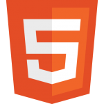

# How to change content for peer1on1.org

## Update Activity Event

It can edit this file `/data/peer1on1_activity.js` to add/update the Peer1on1 activity event, navigate to that file and can use `Edit this file` icon to edit it in Github website.


## Update Activity Post (Blog)

The activity blog post uses the `Markdown` (.md) format, you can have a quick look of this format [here](https://guides.github.com/features/mastering-markdown/).

All the posts should be put in the folder `/content/posts`, you can use button `Create new file` to create new post, it must start with the section below, complete the information for the keyword - date, tile, thumbnail (optional) and slug (this should be same with the file name).
```
---
date: 2019-10-19
title: 'Card Making'
template: post
thumbnail: '../thumbnails/2019-10-19-card-making.png'
slug: 2019-10-19-card-making
---
```
Then write the post by following the markdown format, you can use the image link from otherplace instead of submit the image file in this repository.
Link to image file from the repository:
```

```


Use standard HTML image element to control width of the image:
```

```

After saving the post file, create a `Pull request` to merge the changes to `master` branch, once the change is reviewed and approved, the website will be rebuilt automatically and reflect the changes.


# Set Up Your Development Environment

This section is to set up the development environment to change the website layout through GatsbyJs.

## Install Node.js and npm

Node.js is an environment that can run JavaScript code outside of a web browser. 
- [Install NodeJs on Windows](https://nodejs.org/en/)

npm is a JavaScript package manager. A package is a module of code that you can choose to include in your projects. If you just downloaded and installed Node.js, npm was installed with it!

## Install Yarn

Yarn is, like NPM, a package manager for Node.JS. With yarn.lock file (similar to NPM's npm-shrinkwrap.json) all dependencies are locked on the exact version.

- [Install Yarn on Windows](https://yarnpkg.com/en/docs/install#windows-stable)

## Install Git

Git is a free and open source distributed version control system designed to handle everything from small to very large projects with speed and efficiency. 

The steps to download and install Git depend on your operating system. Follow the guide for your system:

- [Install Git on macOS](https://www.atlassian.com/git/tutorials/install-git#mac-os-x)
- [Install Git on Windows](https://www.atlassian.com/git/tutorials/install-git#windows)

## Install Gatsby CLI

The Gatsby CLI tool lets you quickly create new Gatsby-powered sites and run commands for developing Gatsby sites. It is a published npm package.

The Gatsby CLI is available via npm and should be installed globally by running `npm install -g gatsby-cli`.

To see the commands available, run `gatsby --help`.

## Set up a code editor

A code editor is a program designed specifically for editing computer code. There are many great ones out there.

### Download VS Code

 If you choose to use VS Code, visit the [VS Code site](https://code.visualstudio.com/#alt-downloads) and download the version.

### Run local server:

```shell
git clone https://github.com/peer1on1/peer1on1.org
cd peer1on1.org
yarn
yarn dev
```

Navigate to `localhost:8000` in browser.

